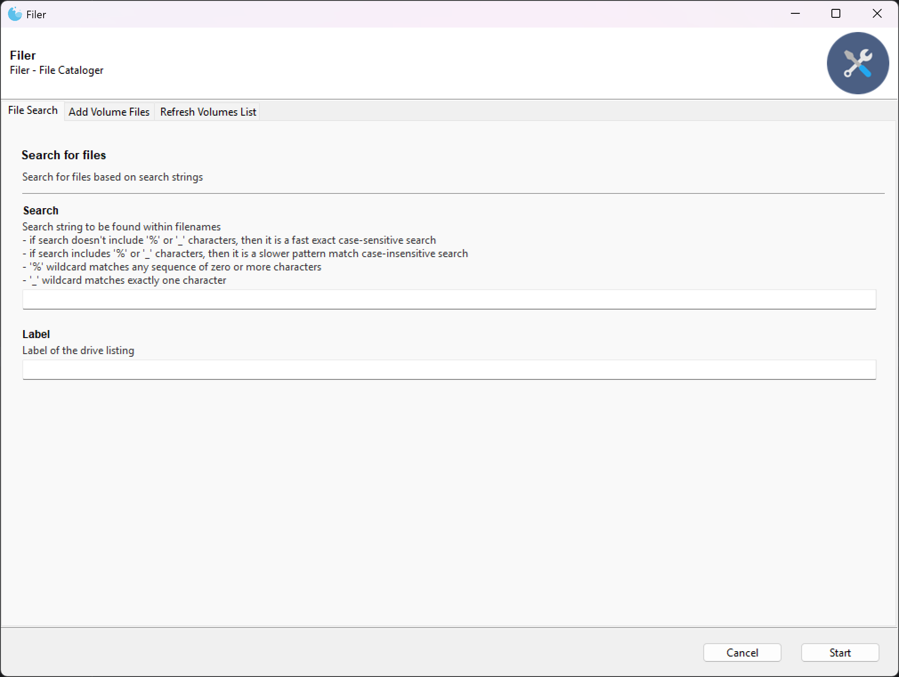

# Filer

A disk cataloger utility to store, search and deduplicate disk and directory listings.

Data is stored within a Sqlite3 database, which allows you to export the database in CSV should you wish to use the data elsewhere.

    

Table of Contents
-----------------  

- [Filer](#Filer)
- [Table of contents](#table-of-contents)
- [Quick Start](#quick-start)
    - [Installation Instructions](#installation-instructions)
    - [Usage](#usage)
    - [Examples](#examples)

----------------  

## Quick Start

### Installation instructions

Download and uncompress the latest release into a directory. Releases are known to work.

Install the following `pip` packages:

    pip install Gooey

Note that currently the `master` branch in GitHub is  work in progress and may not work. 
I haven't created a separate development branch yet and then merging it with the `master` branch when its release ready. 

### Usage

For now, just use the GUI interface. 

For options run:

    python fgui.py -h

### Examples

By default, Filer will create a Sqlite Database in the current directory. 
If you prefer that the database is stored somewhere else, you can specify its location using the option:

    python fgui.py -d <database_filename>

Note that after you have specified the database filename (and path) once, it's stored in the configuration 
file, and you don't need to specify it again.